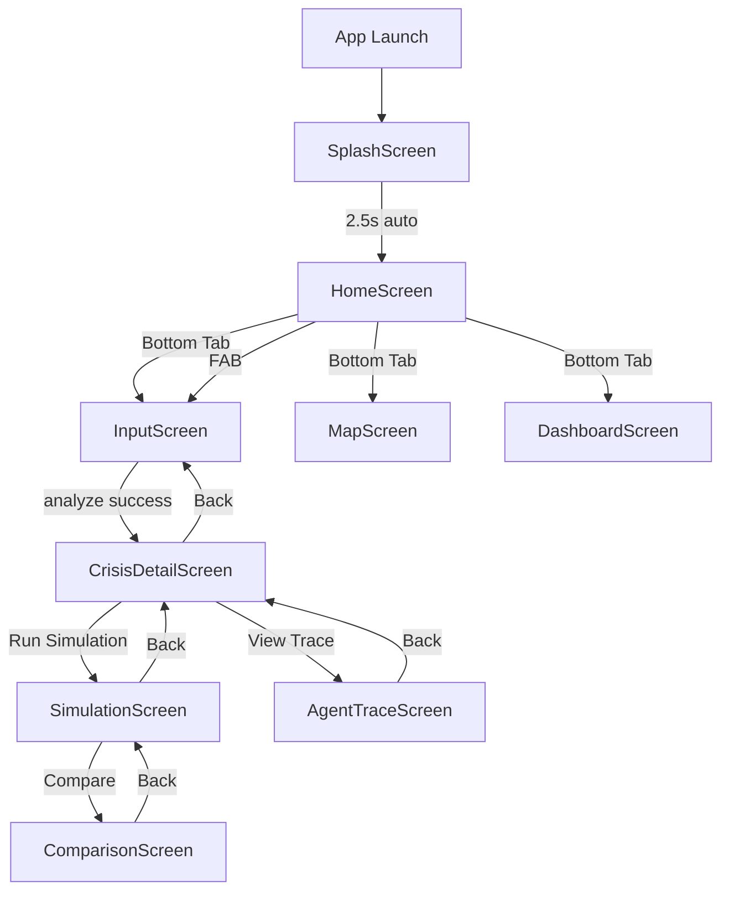

# CIRO — App Flow Document
**Crisis Intelligence & Response Orchestrator**
**Version:** 1.0 | **Date:** May 2026

---

## 1. Navigation Map

```
App Launch
    │
    ▼
[SplashScreen]  ──(auto 2.5s)──▶  [HomeScreen (Tab 1)]
                                         │
                    ┌────────────────────┼────────────────────┐
                    │                   │                     │
             [Report Tab 2]       [Map Tab 3]        [Dashboard Tab 4]
             (InputScreen)        (MapScreen)         (DashboardScreen)
                    │
                    │ (after analyze)
                    ▼
             [CrisisDetailScreen]
                    │
          ┌─────────┼──────────┐
          │         │          │
   [SimulationScreen] [AgentTraceScreen] [ComparisonScreen]
```

---

## 2. User Flows

### Flow A — Citizen Reports a Crisis

```
User opens app
    → SplashScreen (2.5s animated logo)
    → HomeScreen (signal feed loads)
    → Taps [+] FAB or "Report" tab
    → InputScreen
        → Types crisis text in Roman Urdu/English
        → Taps "ANALYZE CRISIS" button
        → Loading animation (agents running)
        → CrisisDetailScreen (crisis info displayed)
            → Taps "Run Simulation"
            → SimulationScreen (action-by-action execution)
            → Taps "View Agent Trace"
            → AgentTraceScreen (full reasoning log)
```

### Flow B — Coordinator Uses Demo Scenario

```
User opens app → HomeScreen
    → Taps "Report" tab → InputScreen
    → Scrolls to "DEMO SCENARIOS" section
    → Taps 🌊 "Urban Flooding - G10"
        → Text field auto-populates
        → Taps "ANALYZE CRISIS"
        → [same as Flow A from CrisisDetailScreen]
```

### Flow C — Monitor Live Signals

```
User opens app → HomeScreen
    → Signal cards stream in from /api/crisis/signals
    → Pull-to-refresh for latest signals
    → Taps a signal card → [no navigation in v1.0, card is informational]
    → Taps dashboard icon → DashboardScreen
        → Views: Active Crises, Signals Today, Actions Done, Avg Time
```

### Flow D — Map Monitoring

```
User opens app → HomeScreen → Taps "Map" tab
    → MapScreen
        → Mock grid visualization of Islamabad sectors
        → Crisis zone markers overlaid
        → [Future: real Google Maps with live resource positions]
```

---

## 3. Screen-by-Screen Flow Detail

---

### Screen 1 — SplashScreen

| Attribute | Detail |
|-----------|--------|
| Purpose | Brand intro + initialization |
| Duration | ~2.5 seconds (animated) |
| Animations | Logo fade-in, tagline slide-up |
| Exit | `onFinish()` callback → NavigationRoot shows MainStack |
| Data | None |

**User Journey:**
```
App opens → CIRO logo animates → "Crisis Intelligence & Response Orchestrator" fades in
→ Auto-dismisses → HomeScreen
```

---

### Screen 2 — HomeScreen (Tab 1: Home)

| Attribute | Detail |
|-----------|--------|
| Purpose | Live signal feed + city overview |
| Primary Component | `FlatList` of `SignalCard` items |
| Header | City name "ISLAMABAD", LIVE pulsing badge, weather strip |
| FAB | Red + button → navigates to Report tab |
| Theme Toggle | Top-right button switches Dark/Light |
| Data Source | `GET /api/crisis/signals` on mount |
| Refresh | Pull-to-refresh → re-fetches signals + haptic feedback |

**User Actions:**
- Pull down → Refresh signals
- Tap FAB → Navigate to InputScreen
- Tap dashboard icon → Navigate to DashboardScreen
- Tap theme toggle → Switch Dark/Light mode

**Empty State:** Animated radar graphic with "Scanning for signals..."

---

### Screen 3 — InputScreen (Tab 2: Report)

| Attribute | Detail |
|-----------|--------|
| Purpose | Crisis report + AI trigger |
| Key Components | TextInput, Analyze button, Demo scenario cards |
| API Call | `POST /api/crisis/analyze` |
| Loading State | `LoadingAgents` component (agent progress animation) |
| Error State | Toast/alert with error message |

**Sub-Sections:**
1. **Text Input Area** — multi-line, placeholder "Describe the emergency in any language..."
2. **Analyze Button** — triggers pipeline
3. **Demo Scenarios** (scrollable row):
   - 🌊 Urban Flooding – G10
   - ⚡ Power Outage – F7
   - 🚗 Road Accident – Murree Road

**State Transitions:**
```
[Idle] → tap Analyze → [Loading: agents animating] → 
    success: → navigate to CrisisDetailScreen(crisis, actions, logs, traces)
    no_crisis: → show "No crisis detected" banner
    error: → show error alert
```

---

### Screen 4 — CrisisDetailScreen

| Attribute | Detail |
|-----------|--------|
| Purpose | Full crisis intelligence display |
| Input Params | `crisis`, `actions`, `execution_logs`, `agent_traces` |
| Sections | Crisis summary card, severity badge, GPS coords, Action list, navigation buttons |

**Displayed Data:**
- Crisis type icon + label
- Severity badge (CRITICAL/HIGH/MEDIUM/LOW with color coding)
- Confidence score (%)
- Affected area + coordinates
- Summary paragraph (Gemini-generated)
- List of planned actions with priority badges

**Navigation Buttons:**
- **"Run Simulation"** → SimulationScreen
- **"View Agent Trace"** → AgentTraceScreen
- **Back** → Returns to InputScreen

---

### Screen 5 — SimulationScreen

| Attribute | Detail |
|-----------|--------|
| Purpose | Step-by-step action execution theater |
| Input Params | `actions`, `execution_logs` |
| Display | Execution timeline cards |

**Timeline Card per Action:**
- Action type icon
- Description
- Status badge (COMPLETED / FAILED)
- Before → After state diff view
- Timestamp

**Navigation:**
- **"Compare Before/After"** → ComparisonScreen
- **Back** → CrisisDetailScreen

---

### Screen 6 — AgentTraceScreen

| Attribute | Detail |
|-----------|--------|
| Purpose | Full reasoning log from all 4 agents |
| Input Params | `agent_traces` array |
| Display | Color-coded log list |

**Color Legend:**
| Color | Agent |
|-------|-------|
| 🔵 Blue | Agent 1 (Signal Ingestion) |
| 🟠 Orange | Agent 2 (Crisis Detection) |
| 🟢 Green | Agent 3 (Action Planning) |
| 🔴 Red | Agent 4 (Execution Simulation) |
| ⚪ White | INFO |
| 🟡 Yellow | WARN |

**Features:**
- Scrollable log list
- Timestamp per entry
- Level badge per entry

---

### Screen 7 — ComparisonScreen

| Attribute | Detail |
|-----------|--------|
| Purpose | Before vs After visualization for each action |
| Input Params | `execution_logs` |
| Display | Split-panel cards: left=before, right=after |

**Card Types:**
- Rescue: `STANDBY → EN_ROUTE`
- Traffic: `BLOCKED → ACTIVE`
- Hospital: `beds: 45 → beds: 35, trauma: ACTIVATED`

---

### Screen 8 — MapScreen (Tab 3: Map)

| Attribute | Detail |
|-----------|--------|
| Purpose | Geographic crisis zone visualization |
| Mode | Mock grid (v1.0) / Google Maps (v1.1+) |
| Data | Crisis zones from session state or API |

**Mock Grid Shows:**
- Sector grid (G-10, F-7, I-9, etc.)
- Crisis markers positioned by lat/lng
- Severity-colored pins

---

### Screen 9 — DashboardScreen (Tab 4: Dashboard)

| Attribute | Detail |
|-----------|--------|
| Purpose | City-wide operational overview |
| Data Source | `GET /api/crisis/stats` |
| Components | `StatCard` components in a 2x2 grid |

**Stat Cards:**
1. 🚨 Active Crises
2. 📡 Signals Today
3. ✅ Actions Done
4. ⏱ Avg Response Time

---

## 4. Complete Navigation Graph



---

## 5. Data Passed Between Screens

| From | To | Data |
|------|----|------|
| InputScreen | CrisisDetailScreen | `{ crisis, actions, execution_logs, agent_traces }` |
| CrisisDetailScreen | SimulationScreen | `{ actions, execution_logs }` |
| CrisisDetailScreen | AgentTraceScreen | `{ agent_traces }` |
| SimulationScreen | ComparisonScreen | `{ execution_logs }` |

---

## 6. API Calls Per Screen

| Screen | API Call | Trigger |
|--------|----------|---------|
| HomeScreen | `GET /api/crisis/signals` | On mount + pull-to-refresh |
| InputScreen | `POST /api/crisis/analyze` | Tap "Analyze" button |
| DashboardScreen | `GET /api/crisis/stats` | On mount |
| MapScreen | (local state / no API in v1.0) | Static |

---

## 7. Theme System

All screens consume `useTheme()` from `ThemeContext`:

```js
const { colors, isDark } = useTheme();
// colors.bg.primary, colors.bg.card, colors.bg.border
// colors.text.primary, colors.text.secondary, colors.text.muted
// colors.severity.critical.bg, colors.severity.critical.text
// colors.severity.high, colors.severity.medium, colors.severity.low
```

Toggle is persistent across app session via ThemeContext state.
